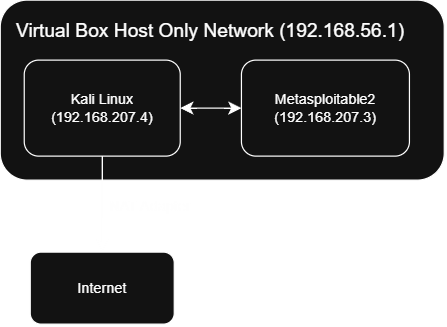

# securityplus-home-lab

This is a hands-on cybersecurity lab that I built to practice concepts from CompTIA Security+ (SYO-701), including vulnerability scanning, exploitation, and remediation planning.

Three distinct vulnerability classes were identified and exploited, with the process being fully documented through recon to remediation.

## Network Topology

Kali Linux and Metasploitable2 are on an isolated VirtualBox host-only network so they have no access to the home LAN or Internet. Kali has a second NAT adapter for Internet access (to enable updates and tooling), while Metasploitable is fully isolated.

## Tools & Environments
- VirtualBox
- Kali Linux (attacker box)
- Metasploitable2 (vulnerable target)
- nmap, Metasploit Framework, netcat

## Skills Demonstrated

| Write-up | Vulnerability Type | Security+ Domains Covered |
|---|---|---|
| [vsftpd Exploitation](docs/02-metasploitable-vsftpd.md) | Supply-chain backdoor | Threats/Vulnerabilites, Security Program Management |
| [Samba Exploitation](docs/03-metasploitable-samba.md) | Misconfiguration / command injection | Threats/Vulnerabilities, Security Architecture |
| [UnrealIRCd Exploitation](docs/04-metasploitable-unrealircd.md) | Supply-chain backdoor (Meterpreter payload) | Threats/Vulnerabilities, Security Program Management |

## Contents
- [Lab Setup](docs/01-lab-setup.md)
- [Metasploitable - vsftpd Backdoor Exploit](docs/02-metasploitable-vsftpd.md)
- [Metasploitable - Samba Exploit](docs/03-metasploitable-samba.md)
- [Metasploitable - UnrealIRCd Backdoor Exploit](docs/04-metasploitable-unrealircd.md)

## Challenges & Troubleshooting
- **vsftpd exploit module failure:** The automated Metasploit module ('vsftpd_234_backdoor') failed with a stuck-listener error after a earlier trigger attempt. Rather than continuing to retry the automated tool, the backdoor was triggered manually at the protocol level via netcast which confirmed the underlying mechanism for the module directly and successfully obtained a root shell.
- **Host networking failure mid-project**: VirtualBox's host-only networking broke at the Windows OS level (Winsock corruption from repeated network adapter reconfiguration), taking down connectiviity for all VMs. Diagnosed and resolved through Windows networking tools ('netsh winsock reset', 'netsh int ip reset') rather than VirtualBox settings alone, since the root cause at the host OS layer and not the hypervisor

## Remediation Philosophy

The remediation section of each exploitation documented in this repo reflects a defender's perspective alongside the offensive technique used, identifying how each vulnerability would be fixed in a real environment.

