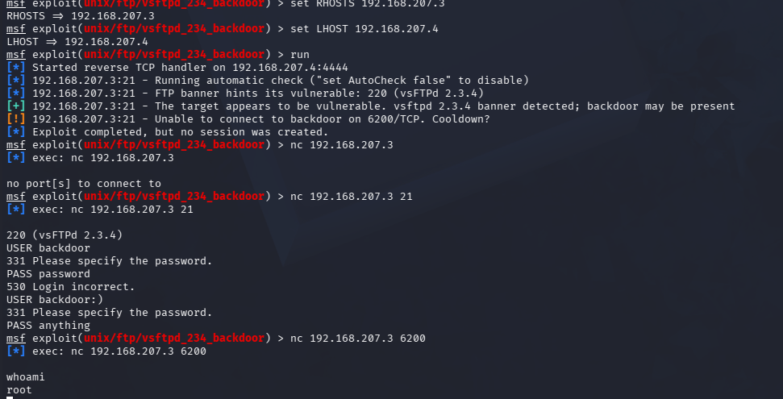

# Exploit vsftpd 2.3.4 Backdoor on Metasploitable 2

## Objective
Identify vulnerable service on the target and exploit it to gain unauthorized root shell access, demonstrating the full attack lifecycle, including adapting techniques when initial attempts failed

## Environment 
- Attacker: Kali Linux (192.168.207.4)
- Target: Metasploitable2 (192.168.207.3)
- Network: Isolated VirtualBox host-only network
- Tools: nmap, Metasploit Framework, netcat

## Recon
Ran a service/version detection scan against the target and found that port 21 was running vsftpd 2.3.4, an outdated version with a publicly known backdoor that grants remote root access to anyone who knows the trigger.

## Exploitation Attempt 1: Metaploit Module
I launched Metasploit and used the built in module for the vulnerability.

This attempt failed with an error that indicated that the backdoor's listener port (6200/TCP) was already in an in-use state, likely from an earlier trigger attempt during testing. The exploit reported completing but no session was created.

Tried rebooting system and resetting listening and remote hosts, but this failed.

Did research online to find that this stuck state is a known quirk with this module and decided to try another method. 

## Exploitation Attempt 2: Manual Trigger (Successful)
Triggered the backdoor manually to understand the underlying mechanism directly. 

Connected terminal 1 to FTP and sent the trigger string (':)' in the username field), which causes the service to open a root shell listener on port 6200.

Connected terminal 2 to the resulting shell.

## Result
I obtained a root-level shell on the target using the manual trigger method. This confirmed that the vulnerability was exploitable through two independent methods and demonstrated the mechanism behind the automated Metasploitable tool.

## Remediation
If this was a real production system, I would do the following to prevent this attack:
- Update vsftpd to a current, patched vesion (Zero Trust Approach)
- Verify software packaes against official signatures before deployment, to catch tampering like this backdoor
- Restrict FTP access to trusted IP ranges through firewall rules
- Disable FTP and use FTPS if file transfer is requuired
- Monitor for unexpected listeners on non-standard ports (like 6200)

## Security+ Concepts Applied
- Vulnerability scanning & enumeration (nmap service/version detection)
- Exploitation of unpatched/backdoored software
- Supply Chain Risk
- Troubleshooting and adapting techniques
