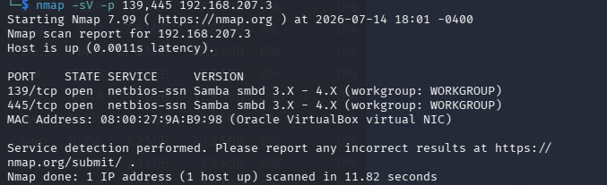

# Metasploitable2: Samba Exploitation

## Objective
Identify misconfigured Samba service and exploit it for remote code execution, demonstrating vulnerability class distinction backdoor.

## Environment
- Attacker: Kali Linux (192.168.207.4)
- Target: Metasploitable2 (192.168.207.3)
- Network: Isolated VirtualBox Host-Only network
- Tools: nmap, Metasploit Framework 

## Recon

I ran a service/version detection nmap  scan against the target and found an open Samba service on ports 139 and 445, version range 3.X-4.X. This version range is associated with a known remote code execution vulnerability that is a known Metasploit exploit under the 'usermap_script' module.

That known exploit targets a command injection vulnerability in older Samba versions via the username field used during authentication.

## Exploitation
I used msfconsole to use the exploit, setting listening host to 192.168.207.4 and remote host to 192.168.207.3. I then ran the exploit.

## Results

A reverse TCP handler was started on 192.168.206.4:4444 and a command shell session opened from the target. 

I obtained a root-level reverse shell on the target which was confirmed with "whooami".

## Remediation
- Update Samba to a current, patched version
- Restrict SMB access (ports 139/445) to trusted internal hosts only via firewall rules
- Segment file-sharing services away from any internet-facing network zones
- Monitor for unexpected reverse shell connections on non-standard ports

## Security+ Concepts Applied
- Vulnerability scanning (nmap)
- Remote code execution vulnerabilites
- Reverse shell technique
- Patch Management
- Network segmentation
- Firewall rules
