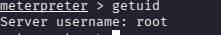

## Metasploitable 2: UnrealIRCd Backdo Exploitation

## Objective
Identify and exploit a second suplly-chain backdoor on a different service, highlighting that the attack technique generalizes across services.

## Enironment
- Attacker: Kali Linux (192.168.207.4)
- Target: Metasploitable2 (192.168.207.3)
- Network: Isolated VirtualBox Host-Only Network
- Tools: nmap, Metasploit Framework

## Recon

 Nmap identified an open IRC service running UnrealIRCd on port 6667. While nmap did not resolve a specific version number in this scan, I tested a known backdoor present in UnrealIRCd 3.2.8.1, where their was a malicious code injection into a distributed software archive. This backdoor provides remote command execution to anyone with the trigger sequence.

## Exploitation
The exploit returned a Meterpreter session instead of a standard command shell.

## Result

Obtained a root-level Meterpreter session on the target via the UnrealIRCd backdoor exploit. Unlike the vsftpd and Samba exploits that used standard command shells, this module utilized a Meterpreter payload which required Meterpreter-specific commands (such as "getuid" to confirm access). 

## Remediation
- Update UnrealIRCd to version verified against official checksums, be careful with trusting download sources
- Apply supply-chain verfication practices, such as digital signatures 
- Restrict IRC service access via firewall rules
- Disable IRC if unused
- Monitor for unexpected Meterpreter/C2-style traffic patterns

## Security+ Concepts Applied
- Vulnerability scanning (nmap service detection)
- Supply chain attacks - real-world risk categories
- Post-exploitation frameworks - Meterpreter is an advanced payload capabilites beyond a basic shell
- Patch management 

